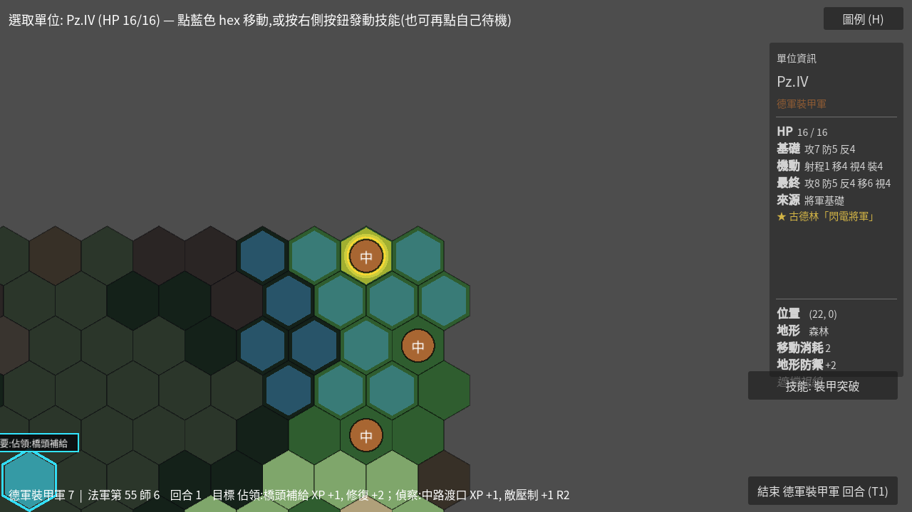
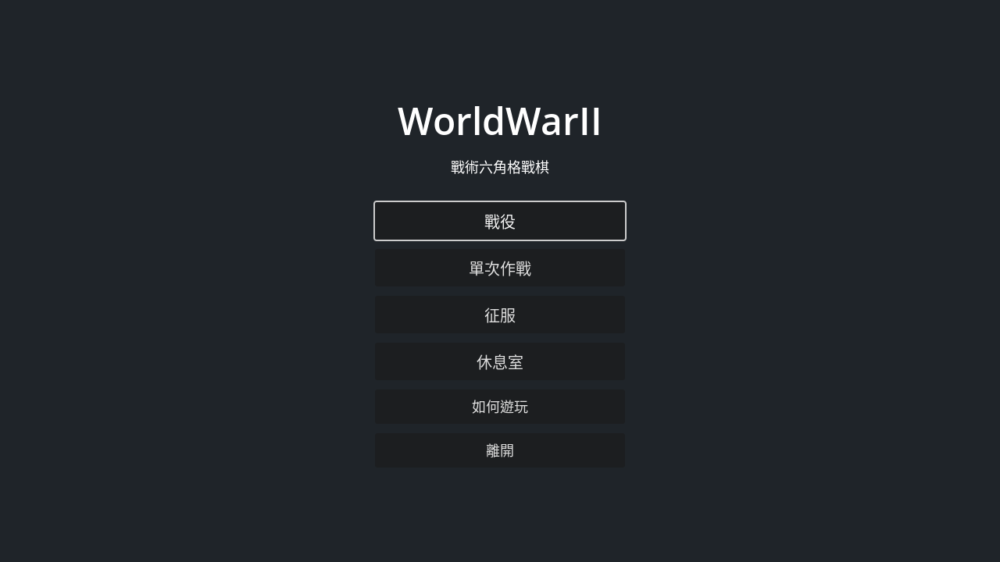
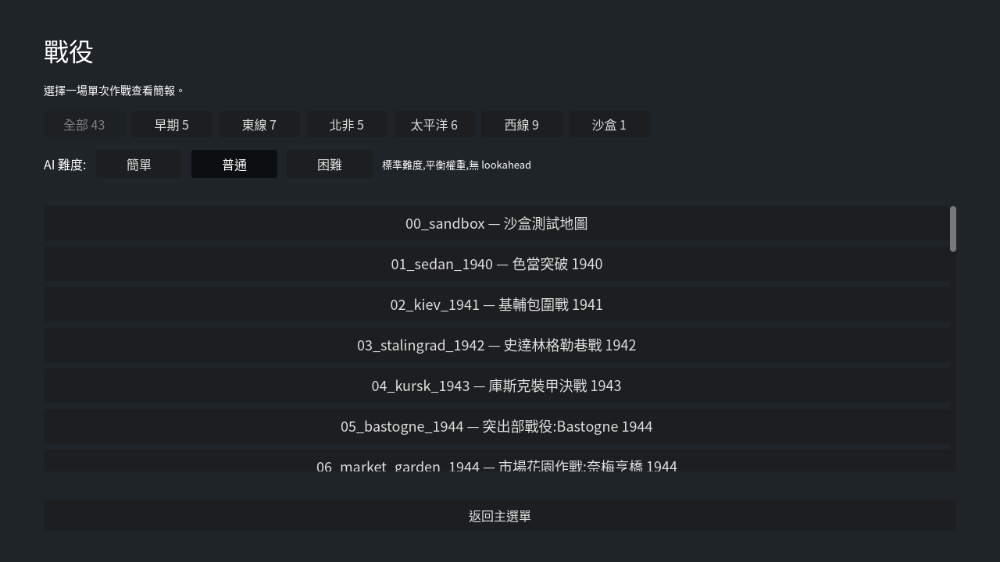
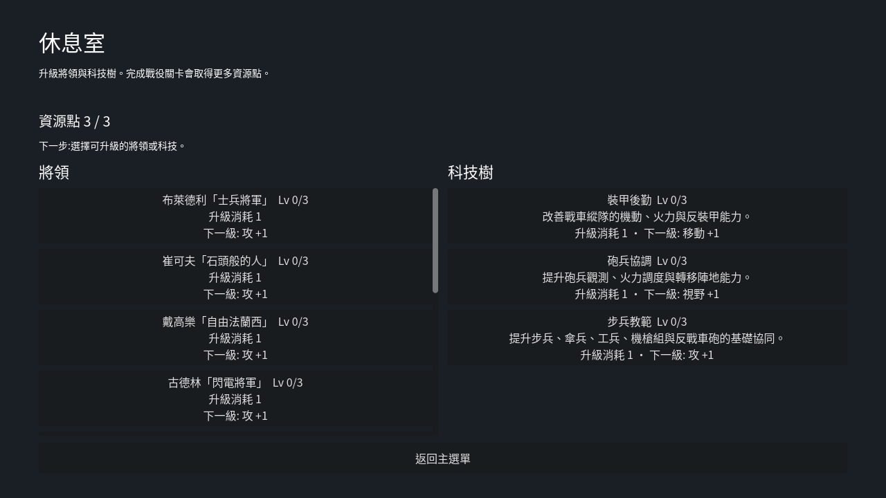
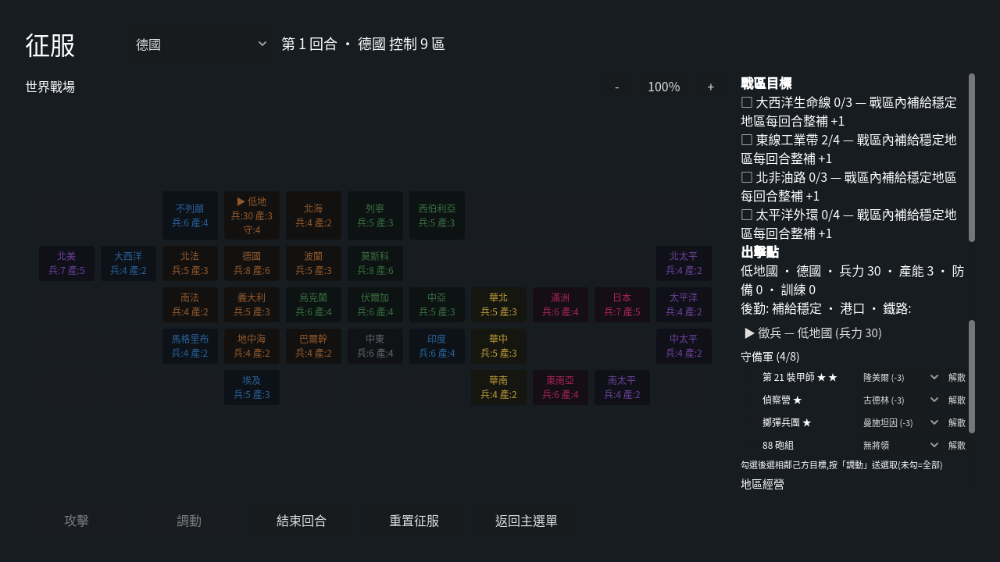

# WorldWarII

Turn-based WW2 tactical hex wargame built with **Godot 4 / GDScript**.

[]() []() []()



## Play / Download

- **Play in your browser:** <https://fischer-zhang.github.io/WorldWarII/> (desktop browser, no install)
- **Download v1.1 (Linux / Windows / macOS):** [latest release](https://github.com/Fischer-Zhang/WorldWarII/releases/latest)

Builds are unsigned: on macOS use right-click → Open, on Windows dismiss the SmartScreen prompt. Any build reproduces locally with `godot --headless --export-release "<Linux|Windows|macOS|Web>"` against the checked-in `export_presets.cfg`.

## What It Is

WorldWarII is a compact tactical wargame inspired by *Panzer General* and *Advance Wars*. It focuses on deterministic hex combat, terrain pressure, visibility, suppression, deployment decisions, campaign carryover and a strategic conquest wrapper that launches real tactical battles.

The project is intentionally data-driven. Units, terrain, scenarios, campaigns, tech, generals and conquest regions live in JSON under `data/`. GDScript owns rules, screen orchestration, validation-facing helpers and UI behavior.

## Current Scope

| Area | Status |
|---|---|
| Engine | Godot 4 project, validated locally and in CI with Godot 4.2.2 stable |
| Language | GDScript for runtime/tests, Python 3 for validators/reports, Bash for validation entrypoints |
| Content | 49 scenario JSON files: 43 single-battle scenarios including `00_sandbox`, plus 6 campaign-only tutorial scenarios |
| Catalogs | 11 unit types, 9 terrain types, 14 generals (every conquest power has a roster), 3 tech upgrades |
| Strategic layer | 6 campaigns, including tutorial campaign 0, and a 32-region conquest map with zoomable world view, supply, port, rail logistics, theater objectives and region development |
| Tests | 424 headless GDScript checks plus static data/report validators, including a deterministic AI self-play difficulty-ladder gate |
| Platforms | Export presets for Linux, Windows, macOS and Web |

## Game Modes

| Mode | Flow | What matters |
|---|---|---|
| Single Battle | Main Menu -> Scenario Select -> Briefing -> Deployment -> Battle | Pick a non-tutorial scenario, choose AI difficulty, assign generals and deploy before fighting. |
| Campaign | Campaign Map -> Lounge -> Briefing -> Battle -> Result | Campaign progress persists roster XP and general assignment; victories grant lounge upgrade points. |
| Conquest | World Map -> Briefing -> Deployment -> Battle -> World Map Result | Region attacks launch tactical battles where the enemy starts on-map; the zoomable world map also lets owned regions recruit, transfer units and develop industry, fortifications or logistics. |

## Highlights

- Deterministic combat: same position, HP, terrain and modifiers always resolve the same way.
- Shared attack legality for player and AI through `CombatRules`.
- Fog of war, line of sight and AI last-known-position memory.
- Zone of control, overwatch, dig-in, suppression, morale/rout, rally and optional secondary objectives layered into movement and action economy; pinned units stop projecting ZoC, routed units withdraw under stress, MG overwatch uses full reaction-fire damage, and MGs can spend an action on short-range suppressive fire.
- Historical generals, veteran XP, lounge upgrades and tech upgrades routed through a shared modifier pipeline.
- Pre-battle deployment with scenario-scoped placement, general reassignment and upgrade breakdown in single battles; conquest uses a free deployment zone for every recruited attacker before battle starts.
- Conquest battles are real tactical battles, not a separate mini-simulator; fortified regions also field stronger strategic and tactical defenses.
- Main-menu how-to-play reference, battlefield legend, tutorial scenario hints, Tab unit cycling and dimmed spent units keep the tactical UI readable during play.
- Static balance reports and UI smoke coverage are part of normal validation.

## Screenshots

| Main menu | Scenario select | Lounge upgrades |
|---|---|---|
|  |  |  |

Conquest world map — each garrison unit is led by a commander (from that power's roster) hired with region strength:



## Environment

This repository is currently validated in the following environment:

| Tool | Verified version |
|---|---|
| OS | Linux x86_64 under WSL2 |
| Godot | `4.2.2.stable.official.15073afe3` |
| Python | `3.10.12` |
| Bash | `5.1.16` |
| Git | `2.34.1` |

Recommended setup on any device:

1. Install Godot **4.2.2 stable** — this is the version the project is pinned to (CI and `validate_fast.sh` both expect it). Do **not** open the project in a newer Godot 4.x editor on a shared device: it silently rewrites `project.godot` (e.g. the `config/features` tag) and can introduce cross-device-breaking changes such as the native Wayland backend.
2. Make sure the Godot executable is available as `godot` on `PATH`.
3. Install Python 3.10+.
4. Use Git with LF line endings for this repo. `.gitattributes` keeps project text files and shell scripts normalized.

Check your local setup:

```bash
godot --version
python3 --version
git --version
```

## Project Configuration

Key settings in `project.godot`:

| Setting | Value |
|---|---|
| Main scene | `res://scenes/main_menu.tscn` |
| Window | `1280x720`, `canvas_items` stretch, `expand` aspect |
| UI layout contract | Desktop-first at `1280x720` and `1366x768`; smaller windows are not currently guaranteed |
| Renderer | `gl_compatibility` for desktop and mobile |
| Autoloads | `AppTheme`, `DataLoader`, `GameState`, `AudioBank`, `ScreenshotHelper` |
| Theme | Global UI theme in `assets/theme/ww2_theme.tres` |
| Fonts | Bundles Noto Sans CJK TC (`assets/fonts/`, SIL OFL 1.1) as the default theme font and `ThemeDB.fallback_font`, so Chinese text renders on every machine — including the Web build — without depending on host system fonts |
| Camera input | WASD actions mapped as `ui_camera_pan_*` |
| CI engine | GitHub Actions workflow [`.github/workflows/validate.yml`](.github/workflows/validate.yml) downloads Godot `4.2.2-stable` and runs `tools/validate.sh` |

The project is pinned to Godot 4.2.2: `config/features` is `PackedStringArray("4.2", "GL Compatibility")`, and `tools/validate_fast.sh` fails if that tag drifts. If you open the project in a newer Godot editor it will rewrite this tag (and may rewrite other settings) — revert those edits before committing so every device runs the same engine.

## Running Locally

Clone and launch:

```bash
git clone git@github.com:Fischer-Zhang/WorldWarII.git
cd WorldWarII
godot --path .
```

Run from the editor by opening the folder that contains `project.godot`. The main scene is `res://scenes/main_menu.tscn`.

Useful controls:

| Action | Input |
|---|---|
| Select unit | Click a friendly unit |
| Move | Click a blue reachable hex |
| Attack | After moving/selecting, click a red target |
| Overwatch | Use `進入警戒` |
| Rally | Use `整隊` when suppressed |
| End turn | Bottom-right button |
| Cycle unacted unit | Tab / Shift+Tab |
| Camera | WASD, mouse wheel, middle-drag |
| How to play | Main-menu guide button or battlefield legend |
| Screenshot | F12 |

### Troubleshooting: only a taskbar icon, no window (native Linux)

If launching shows a taskbar icon but the window never appears, the project config is not the cause (no script touches the window; `[display]` sets only size + stretch). It is almost always the local engine/driver/display-server. Diagnose from a terminal so you can read stderr:

```bash
# Run from a terminal and capture the exit code — never silently double-click.
godot --path . --verbose ; echo "exit=$?"          # or, for an exported build:
./WorldWarII.x86_64.console --verbose ; echo "exit=$?"
# exit 139 (SIGSEGV) / 134 (SIGABRT) → GL context failed to create
# exit 0 / still running but invisible → window opened off-screen

echo "session=$XDG_SESSION_TYPE display=$DISPLAY wayland=$WAYLAND_DISPLAY"

# Universal first fix — force the validated X11 + OpenGL path.
# Pass all three flags together: --rendering-driver alone can flip the method to forward_plus.
godot --path . --display-driver x11 --rendering-driver opengl3 --rendering-method gl_compatibility
```

- Window appears only with `--display-driver x11` → it was the native Wayland backend (Godot 4.3+). Keep X11, or set GNOME scaling to an integer multiple.
- Crash with `OpenGL`/`GLX`/`FBConfig` in the log → driver issue: `sudo apt install --reinstall mesa-utils libgl1-mesa-dri libglx-mesa0`, then check `glxinfo | grep -E 'OpenGL version|direct rendering'` (need ≥ 3.3, direct: Yes). Dual-GPU laptops: prefix `DRI_PRIME=1` (Mesa) or `__NV_PRIME_RENDER_OFFLOAD=1 __GLX_VENDOR_LIBRARY_NAME=nvidia`.
- Process alive but invisible → off-screen window: `wmctrl -lG` to find it, `wmctrl -r WorldWarII -e 0,50,50,1280,720` to pull it back.

## Cross-Device Workflow

Use Git for source/content sync. Do not copy the `.godot/`, `exports/`, `dist/` or local `user://` data folders between machines.

Tracked and portable:

- `project.godot`, `export_presets.cfg`
- `data/**/*.json`
- `scenes/**/*.tscn`
- `scripts/**/*.gd` and `.uid` files
- `tests/`, `tools/`, `docs/`, `.github/`

Ignored or local-only:

- `.godot/`: Godot editor/import cache rebuilt per machine
- `exports/`, `dist/`, `build/`, `bin/`: generated builds
- `user://campaign_save.json`: campaign/lounge/conquest save data
- `user://last_replay.json`: last battle log
- `user://screenshots/`: F12 captures

Godot stores `user://` outside the repository. Common paths:

| OS | Typical `user://` path |
|---|---|
| Linux / WSL2 | `~/.local/share/godot/app_userdata/WorldWarII/` |
| Windows | `%APPDATA%\Godot\app_userdata\WorldWarII\` |
| macOS | `~/Library/Application Support/Godot/app_userdata/WorldWarII/` |

Recommended sync sequence when moving between devices:

```bash
git pull --ff-only
tools/validate_fast.sh
godot --path .
```

Before pushing work from any device:

```bash
tools/validate.sh
git status --short
git add <changed files>
git commit -m "describe the change"
git push
```

For Windows, run validation from Git Bash, WSL2 or another Bash-compatible shell. If shell scripts lose execute permission, run:

```bash
chmod +x tools/*.sh tests/run_all.sh
```

## Validation

Fast validation without launching Godot:

```bash
tools/validate_fast.sh
```

Full validation:

```bash
tools/validate.sh
```

`tools/validate.sh` runs:

- The Godot 4.2 project-feature gate in `project.godot`.
- JSON syntax checks for unit data and balance baselines.
- Python compile checks for report, probe and validator scripts.
- `tools/validate_data.py` for unknown refs, bounds, duplicate coordinates, campaign references and conquest graph integrity.
- Generated diagnostics: unit balance report, scenario pressure report, scenario probe, tutorial probe, Godot AI trace report and Godot AI self-play report. See [docs/REPORTS.md](docs/REPORTS.md) for generator/checker ownership and review guidance.
- Focused report checks for Stalingrad/Berlin urban breach diagnostics and scenario breach-path coverage.
- `git diff --check`.
- 424 headless GDScript checks through `bash tests/run_all.sh`.

The UI smoke test loads these screens headlessly: main menu, how-to-play, scenario select, briefing, deployment, battle, campaign, lounge and conquest. The UI layout test checks the same major screens against the supported desktop viewport contract, and the UI workflow test verifies key cross-screen interactions such as scenario filtering, deployment selection, battle action prompts, conquest source/target selection, map zoom and region development controls.

Install the local pre-commit validation hook:

```bash
tools/install_hooks.sh
```

## Exporting Builds

Export presets exist for:

| Preset | Output |
|---|---|
| Linux | `exports/WorldWarII-linux-x86_64/WorldWarII.x86_64` |
| Windows | `exports/WorldWarII-windows-x86_64/WorldWarII.exe` |
| macOS | `exports/WorldWarII-macos/WorldWarII.zip` |
| Web | `exports/WorldWarII-web/index.html` |

Generated exports are ignored by Git. Rebuild them per device or publish them as release artifacts.

## Systems In Brief

Combat formula:

```text
base = max(1, attack + vs_armor_if_target_armored - defense - terrain_defense)
damage = max(1, round(base * attacker_hp / attacker_max_hp))
```

Combat modifiers come from veteran rank, generals, general upgrades, tech upgrades and temporary skill effects. Deployment shows detailed source lines; the battle info panel shows compact final values plus source summary. Non-lethal hits apply suppression pressure and drain morale; a unit whose morale hits zero routs, withdraws automatically, and cannot be ordered until it reforms. Rally reduces suppression and restores morale, with better suppression recovery in defensive terrain. Light tanks can spend their action to mark a visible LOS target for fire support, adding +1 suppression to the next same-faction active attack that deals non-lethal damage to that target. Engineers can spend their action to mark a nearby entrenched target for breach support, adding +1 dig-in loss to the next same-faction active attack that damages that target.

Secondary objectives can grant one-time in-battle rewards such as XP, recovery, repair, faster reinforcements or local suppression of nearby enemies. In campaign mode they stay scenario-scoped; only victory progress grants lounge points, while conquest templates can still feed conquest-map strategic effects. AI scores movement candidates by distance, terrain, exposure, attack value, kill value, counter-damage risk, role shaping and objective pressure. It also evaluates light-tank fire-support marks and engineer breach-support marks when a same-faction follow-up attacker can use the bonus. Wounded and veteran units feel a scale-based preservation pull toward safety when no profitable kill is on offer, so the AI stops trading away its leveled units; a clean kill still overrides it. Difficulty is a weight ladder over several axes — trade aggression, retaliation-lookahead weight, turn-level coordination, unit preservation and a deterministic Easy positioning-error budget. The net-exchange lookahead (anti gang-up, discounted return fire, kill-zone) and turn-level focus-fire / support-mark coordination run at *every* difficulty, scaled by weight: Hard weights them highest and preserves veterans aggressively, while Easy keeps them low, never retreats and occasionally misplaces a unit. A deterministic AI self-play report (`tools/ai_selfplay_report.gd`) plays full headless AI-vs-AI battles and gates the difficulty ladder. `tools/ai_trace_report.gd` regenerates `docs/progress/ai_trace_report.md` from the live `AIController.plan_trace_for_unit()` diagnostics, including primary/secondary objective score splits, support-mark scores and the preservation pull.

Conquest region data is stored in `data/conquest_map.json`. Player attacks choose an existing tactical scenario through `ConquestCatalog`; `ConquestBattleSetup` reuses that battlefield's terrain while replacing factions, rosters and victory rules, then `ConquestManager` applies the fought result back to ownership, strength and surviving garrisons. The world layer also tracks supply sources, ports, rail links and theater objectives; completed theater objectives improve reinforcement in their player-controlled supplied regions. Owned regions can spend local strength on development actions: industry raises future production, fortification raises defense strength, logistics can extend ports or supply sources, and training academies give newly recruited units starting XP. Before launching an attack, the source region can spend local strength on one-time recon, barrage or supply preparations for that target, reducing generated defender strength or giving the attacking garrison starting battle XP. Front-line regions can also invest in one-time defense preparations, weakening the next incoming attack, adding MG support or giving defenders starting XP.

## Project Layout

```text
data/       JSON units, terrains, generals, techs, campaigns, conquest map, scenarios
scenes/     Godot scenes
scripts/    autoloads, grid, units, combat, turn AI, scenario managers, UI
tests/      headless GDScript tests
tools/      validators, reports, local hooks
docs/       architecture, demo script, progress reports, screenshots
```

Detailed system notes: [docs/ARCHITECTURE.md](docs/ARCHITECTURE.md)

Data authoring schema (catalogs, scenarios, campaigns, conquest): [docs/DATA_SCHEMA.md](docs/DATA_SCHEMA.md)

Conquest mode reference (regions, economy, supply, generals, battle handoff): [docs/CONQUEST.md](docs/CONQUEST.md)

Generated report index and review workflow: [docs/REPORTS.md](docs/REPORTS.md)

Demo capture plan: [docs/DEMO_SCRIPT.md](docs/DEMO_SCRIPT.md)

Release build/runbook: [docs/RELEASE.md](docs/RELEASE.md)

## Adding A Scenario

1. Copy a JSON file in `data/scenarios/`.
2. Change `id`, `title`, `briefing`, `map`, `factions`, `units` and `victory`.
3. Use odd-r offset coordinates in JSON; runtime converts to axial hex coordinates.
4. Check [docs/DATA_SCHEMA.md](docs/DATA_SCHEMA.md) for optional fields such as reinforcements, secondary objectives, tutorial mechanics and conquest victory templates.
5. Run `tools/validate_fast.sh`.
6. Launch the game. Normal scenarios appear automatically in the single-battle list.

Tutorial scenarios use `tut_` ids, set `deployment_locked: true`, list `tutorial_mechanics`, and are campaign-only through `00_tutorial` in `data/campaigns.json`; they are intentionally hidden from Single Battle. `tools/tutorial_probe.py` verifies that their declared mechanics are actionable from authored starting positions.

## Roadmap

Done:

- Hex movement, deterministic combat and turn cycle.
- Fog of war, LOS, ZoC, overwatch, dig-in, suppression and rally.
- Single battle, campaign, lounge upgrades and conquest-to-battle flow.
- Deployment setup and upgrade visibility.
- Per-region conquest battlefields with terrain notes surfaced in briefing.
- In-game how-to-play screen, main-menu beginner entry, battlefield legend and tutorial scenario hint blocks (rules, combat formula, terrain/unit tables, status glossary).
- Campaign-only tutorial campaign 0 covering movement, attacks, capture, secondary objectives, terrain, ZoC, overwatch, suppression, rally, dig-in, LOS, indirect fire, spotting, armor/AT, engineer bridge/breach, airdrop, generals, veterans, reinforcements and splash damage.
- Tab / Shift+Tab unit cycling and stronger spent-unit dimming for turn management.
- Headless validators, balance reports and UI smoke coverage.
- Data schema, generated-report index and release runbook for maintainers.

Open:

- Save/load mid-scenario.
- Art replacement for tiles and units.
- Optional interactive step tracker beyond the shipped help page, tutorial hints and playable tutorial campaign.
- Automated release artifact publishing beyond the manual release runbook.

## License

MIT for code. Historical scenario text is original. Any future third-party audio/art should keep its own license notes.
